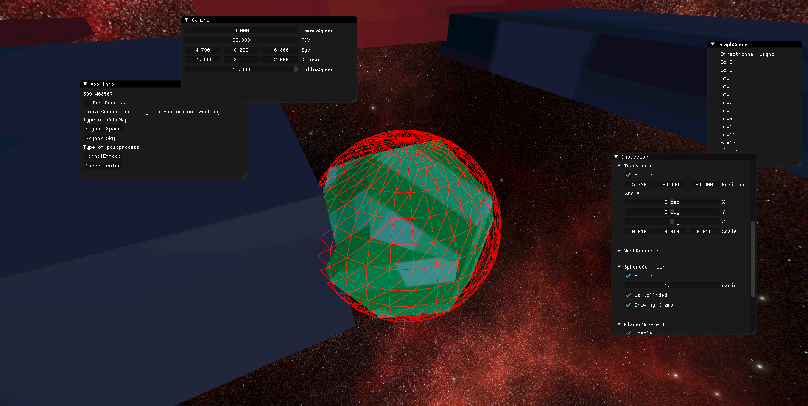
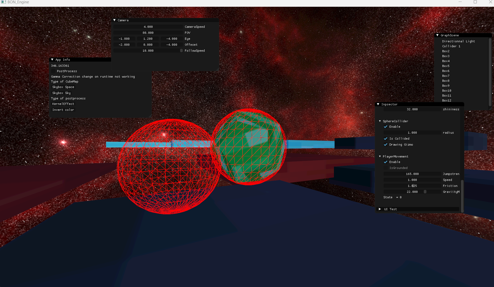
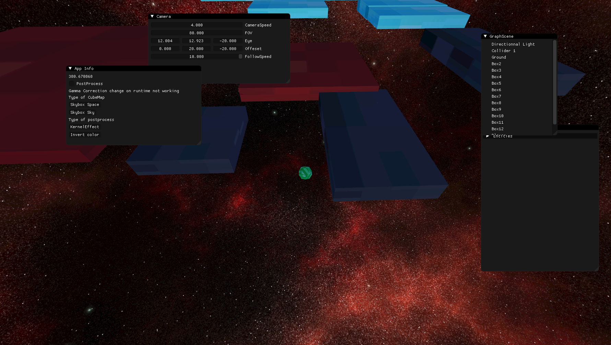
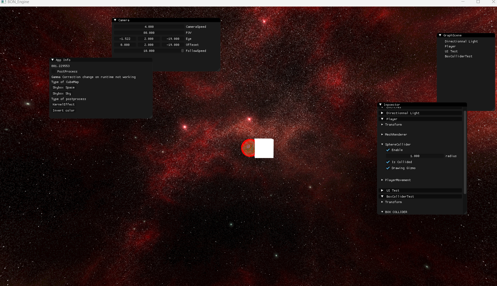

# Bon_Bussy Platformer 3D

## Supported Collision 
### AABB Collision with Sphere 

### Sphere with Sphere

### Sphere Plane : If you fall under Y = -15 the player will be drag to 0 0 0

### Sphere with ended Plane Wip Progress

Unfortunately we couldn't implement this type of collision because it only worked if the square was at the origin.
 It's unfortunate because we wanted to use it for tilted platforms.

